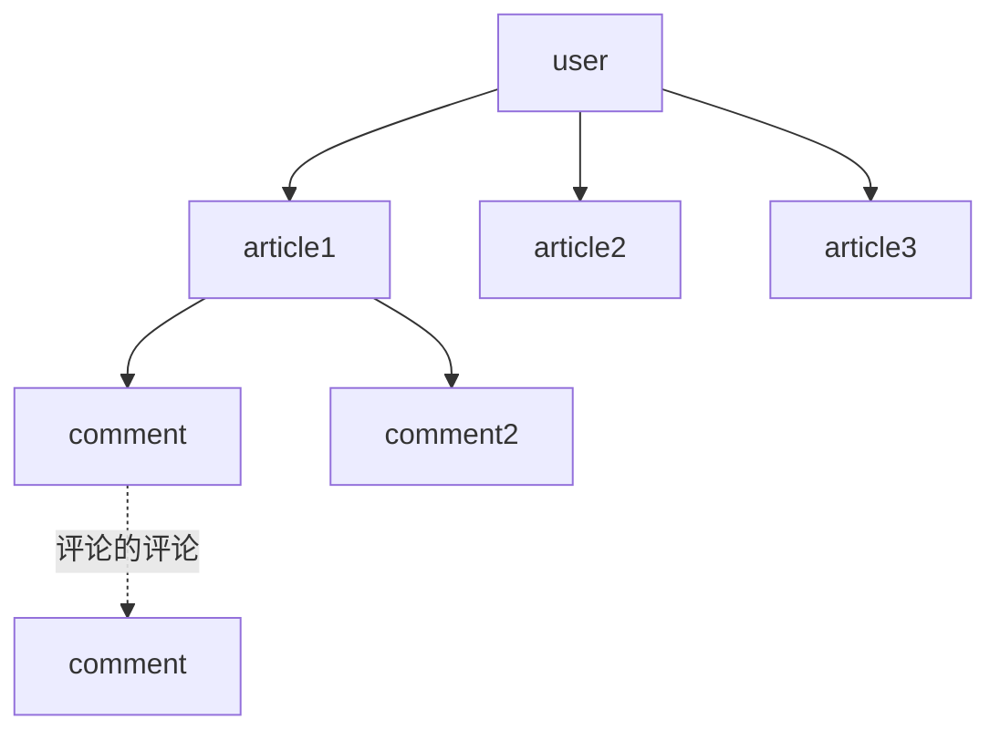

# 系统分析与设计

## 综合设计

### 项目名称: MyBlog

### 项目简介

> 本项目目标是实现一个高并发, 用户友好型的个人博客系统

技术栈:

- 后端 spring boot
- 前端 vue + vuetify
- 数据 sql server + redis

## 需求分析 + 接口设计

#### 需求来源

谁需要这个系统: 

- 某些有撰写个人博客需求, 不满足于市面上界面繁杂, 功能繁琐的博客系统的人
- 有阅读博客需求但是不想登陆的人

|    角色    | 需求优先级 | 影响程度 |  参与度  |
| :--------: | :--------: | :------: | :------: |
|  文章作者  |     高     |    高    | 主动提供 |
|  游客读者  |     中     |    中    | 间接反馈 |
| 系统管理员 |     高     |    低    | 被动审核 |

场景限定: 只有 web 端支持

#### 功能性需求

- 高并发的后端设计, 可以承载大流量访问
- 安全, sqlserver 采用 tde 加密
- markdown 编写界面
- markdown 渲染的展示界面

这个博客系统必须要有以下功能:

- 界面设计:
  - 上必须要有一个主页, 用于展示所有文章
  - 一个文章详细界面(阅读界面) -> markdown 渲染器
  - 一个文章撰写界面 -> markdown 编辑器
  - 一个登陆界面 + 注册
  - 设置界面(可能)
  - 文章有评论区, 评论可以嵌套
- 安全性方面: 登录认证(token鉴权), 路由守卫(前端)
- 高并发处理: 使用 redis 作为缓存

### API 设计

关于 用户 /user

- /login 登录 POST
- /register  注册 POST
- / 更新 PATCH
- / 注销用户 DELETE 
- /upload_avatar 上传头像 POST

关于 文章 /article

- /  获取用户的文章, 用于首页展示 GET
- /{article_id} 更新文章(增量更新) PATCH 
- / 新建文章 POST
- /{article_id} 删除文章(级联删除) DELETE
- /{article_id} 获取文章详情 GET

关于 评论  /comments

- /{article_id} 获取对应文章的所有 评论树 GET
- /{article_id} 新建一个文章评论 POST
- /for_comment/{article_id} 新建一个文章的评论的评论
- /{comment_id} 删除一个评论, 级联删除

## 项目功能结构(流程)

## 模型设计(数据库表设计)

> 设置级联删除, 删除 user 同时删除 他所属的所有  article  和 article 对应的所有 comment 	

**user**

- username 
- password ( 存储哈希值)
- avatar_url ( 头像的 url )

article

- titile 标题
- update_time(如果是新建的话, 更新时间就是新建时间)
- content 文章内容 
- status ( 发布/草稿)
- cover 文章封面
- user_id 外键

comment

- create_time 评论时间
- content 评论内容 
- parent_comment_id 指向父级评论, 如果这个字段是 NULL 那么他就是顶级评论
- article_id 外键
- user_id 外键

